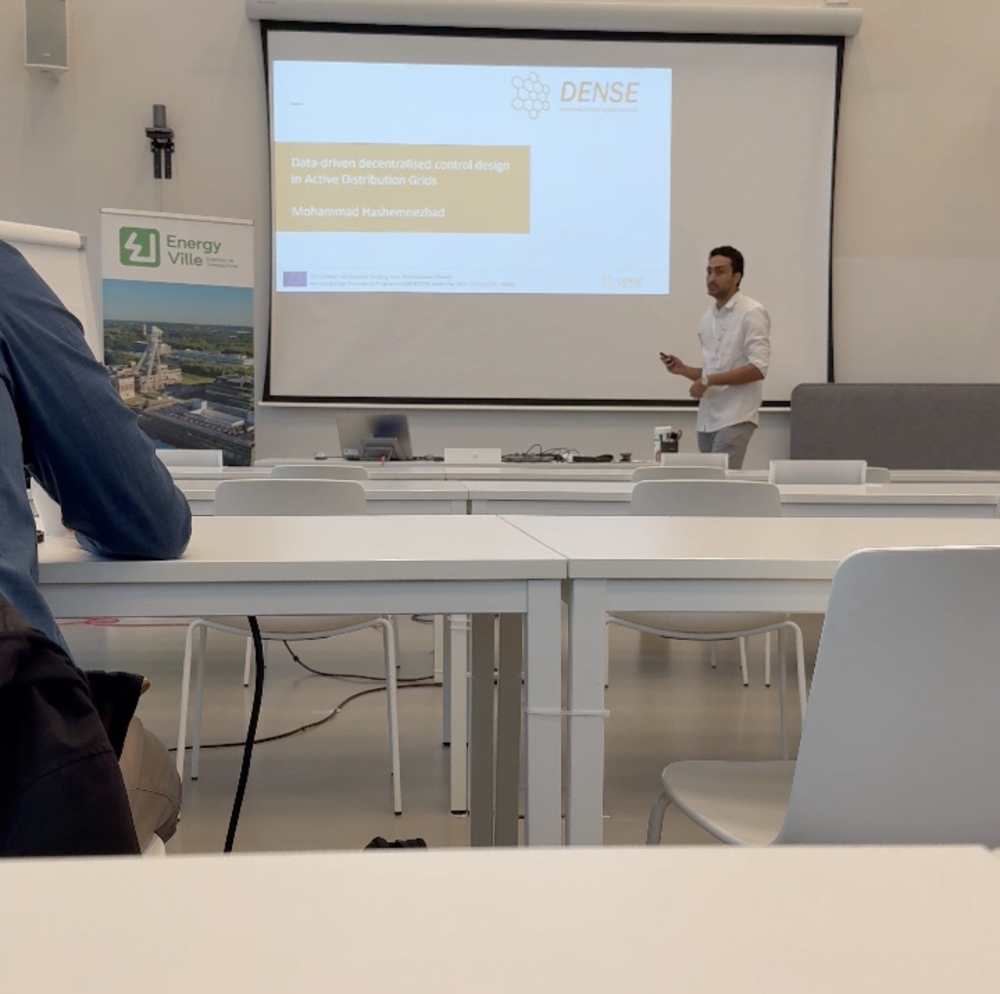
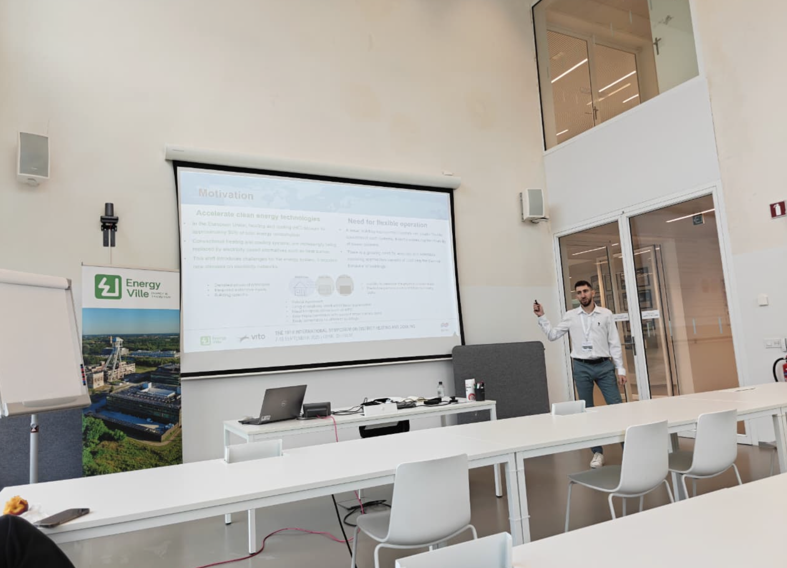

The SPS Lab proudly participated with two PhD students in the 2025 District Heating and Cooling Symposium, held in Genk, Belgium.
This leading international event gathered academics, industry experts, and practitioners to exchange knowledge and showcase the latest innovations in district heating and cooling technologies. The symposium served as a platform for discussing sustainable solutions, innovative system designs, and pathways toward decarbonized energy infrastructure. For more details about the event, please visit the official website: https://www.iea-dhc.org/

## DENSE Doctoral Gathering

As part of the symposium, the DENSE doctoral network organized a dedicated session where each doctoral candidate presented their ongoing research and future directions. This gathering provided an excellent opportunity for students to share progress, exchange ideas, and strengthen collaboration across different projects. This project has received funding from the EU’s Horizon Europe Framework Programme (HORIZON) under the GA n. 101120278 - DENSE.

### A Data-Driven Control of Active Distribution Networks — Mohammad Hashemnezhad (DC3)

Mohammad Hashemnezhad presented his research on data-driven, decentralized control strategies for voltage regulation in active distribution networks (ADNs). His approach combines multi-agent reinforcement learning (MARL) with a deep neural network safety layer to ensure safe operation under uncertainty, and a graph neural network (GNN)-based power flow estimator to replace conventional solvers with a faster, scalable alternative. The results, tested on a modified IEEE 33-bus network with real load and PV data, show significant improvements in maintaining voltages within safe limits while reducing power losses

## Grey-Box Thermal Modeling for Building Applications — Savvas Panagi (DC6)

Savvas Panagi presented his work on tuning grey-box models for thermal building applications, which aim to balance physical interpretability with data-driven adaptability. His study evaluates different model structures (from simple 1R1C to more complex 4R3C networks) and highlights the trade-offs between accuracy, computational cost, and parameter plausibility. Among them, the 3R2C model emerged as the most stable, providing reliable performance with moderate complexity. His future work will extend these models to enable optimal operation of heat pumps in active distribution grids

