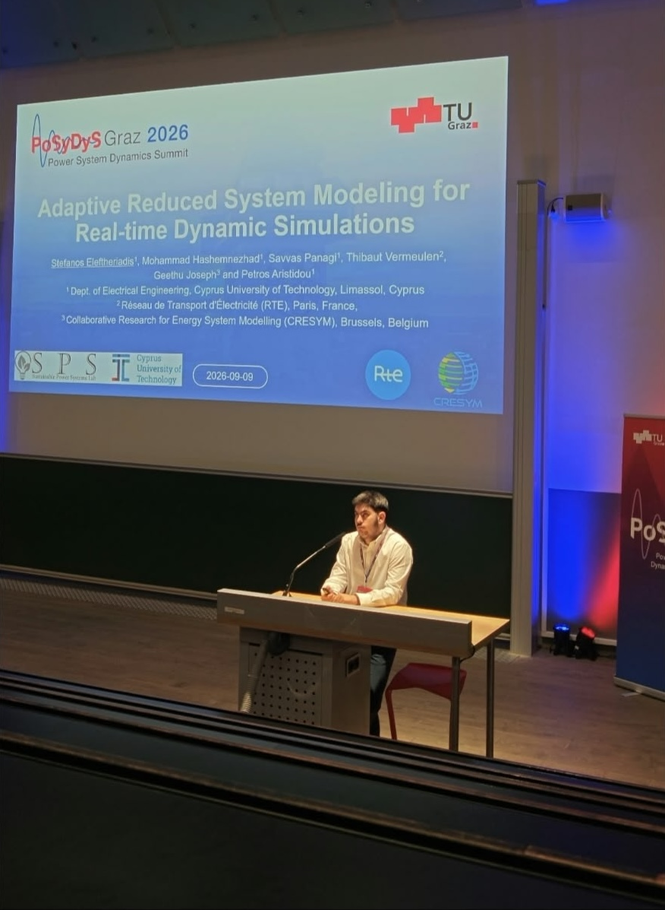
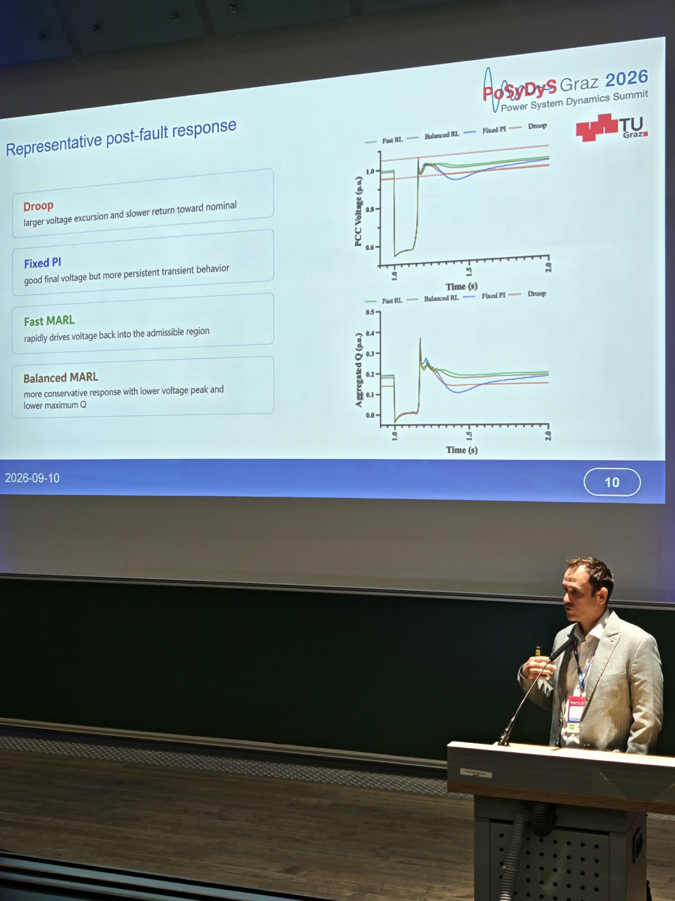
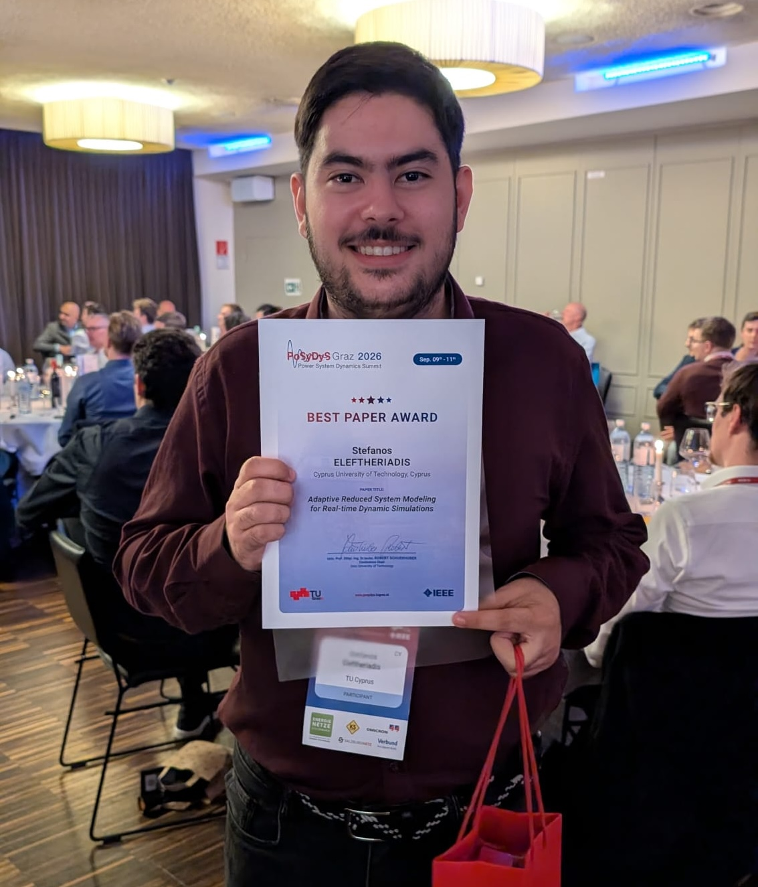

The Sustainable Power Systems Lab participated in the first [Power System Dynamics Summit (PoSyDyS)](https://posydys.tugraz.at/), held from 9–11 September 2026 in Graz, Austria. Organised by Graz University of Technology, PoSyDyS is an international gathering of the power-system dynamics community, bringing together researchers, engineers, and students from around the world to exchange recent scientific developments and emerging ideas in modelling, simulation, and stability of modern power systems.

SPS-Lab was represented by PhD researchers Stefanos Eleftheriadis and Mohammad Hashemnezhad, who presented their latest research on real-time dynamic simulation and post-fault voltage recovery in active distribution networks.

## Adaptive Reduced System Modeling for Real-time Dynamic Simulations — Stefanos Eleftheriadis (TRAISIM, DENSE)

Stefanos Eleftheriadis presented the paper “Adaptive Reduced System Modeling for Real-time Dynamic Simulations,” co-authored with Mohammad Hashemnezhad, Savvas Panagi, Thibaut Vermeulen, Geethu Joseph, and Petros Aristidou.

The work, carried out within the TRAISIM and DENSE projects, proposes an Adaptive Model Selection (AMS) framework that automatically reduces a full-detail dynamic model to a smaller, contingency-specific model by identifying which substations require full fidelity and simplifying the rest. Given the pre-disturbance operating state and event location, Graph Attention Network (GAT)-based predictors classify each component’s expected dynamic activity; substations predicted to be inactive are simplified from node-breaker to bus-breaker representation.

Applied to a realistic French transmission network model with more than 6,000 buses, AMS reduces continuous and discrete model variables by approximately 60%, achieves up to 2.6× simulation speedup, and keeps trajectory errors below the numerical solver tolerance.

## MARL-Based Supervisory Reactive Power Control for Post-Fault Voltage Recovery — Mohammad Hashemnezhad

Petros Aristidou presented the paper “MARL-Based Supervisory Reactive Power Control for Post-Fault Voltage Recovery in Active Distribution Networks,” co-authored with Mohammad Hashemnezhad.

The work, carried out within the DENSE – Dependable Smart Energy Systems MSCA Doctoral Network, proposes a Multi-Agent Reinforcement Learning (MARL) supervisory controller that coordinates PV-inverter reactive-power setpoints after fault clearing. Actions are held fixed during the fault-on interval so as not to interfere with fast inverter inner-loop and fault ride-through dynamics.

The approach is evaluated with RMS dynamic simulations on a modified IEEE 33-bus distribution network over 101 operating and fault scenarios. Compared with droop and fixed-parameter PI baselines, the learned policies mainly improve transient recovery behaviour, particularly in terms of settling time, post-fault time within the admissible voltage band, and voltage-violation area. Fast MARL provides the strongest recovery-oriented performance, while Balanced MARL offers a more conservative response with lower voltage peaks and reduced peak reactive-power injection.

## Best Paper Award

We are pleased to share that the paper “Adaptive Reduced System Modeling for Real-time Dynamic Simulations” received the Best Paper Award of the first PoSyDyS.

