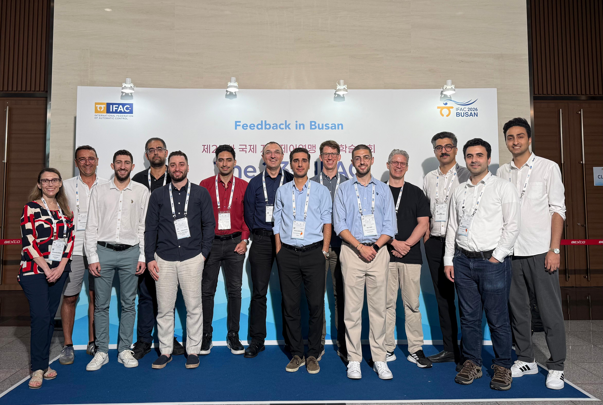
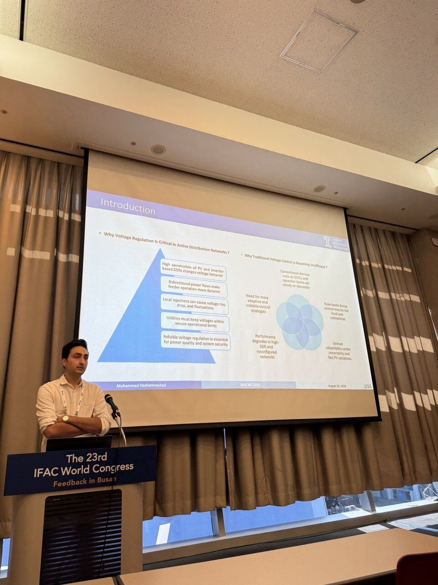
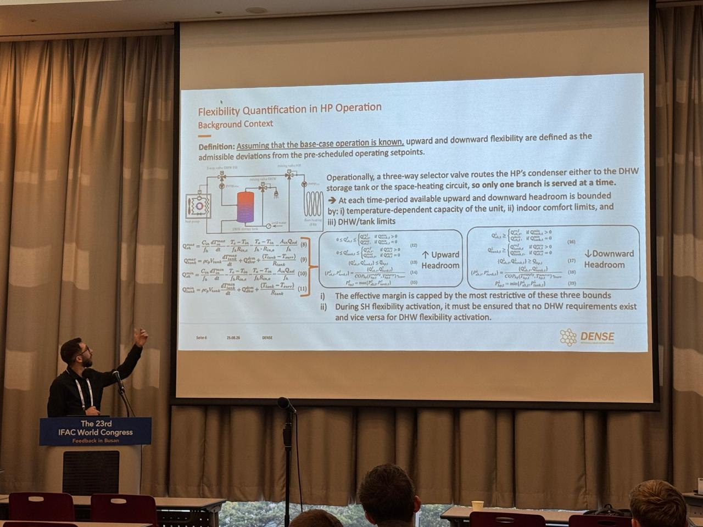

The Sustainable Power Systems Lab participated in the 23rd IFAC World Congress, held from 23–28 August 2026 in Busan, Republic of Korea. Organized every three years, the IFAC World Congress is one of the major international gatherings of the automatic control community, bringing together researchers, engineers, and students from around the world to exchange recent scientific developments and emerging ideas in systems and control.

SPS-Lab was represented by PhD researchers Mohammad Hashemnezhad and Savvas Panagi, who presented their latest research on the operation and flexibility of active distribution networks.

## Strong DENSE Presence at IFAC 2026

The Congress also marked a strong presence of the DENSE – Dependable Smart Energy Systems MSCA Doctoral Network, with eight DENSE doctoral candidates presenting their latest research across the conference.

Six DENSE researchers presented their work back-to-back in a dedicated invited session, covering topics ranging from data-driven control and fault detection to renewable energy systems, thermal networks, and demand response. Two additional DENSE researchers, including SPS-Lab's Savvas Panagi, presented their work in other technical sessions of the Congress.

The gathering provided an excellent opportunity for the DENSE doctoral candidates to reconnect, exchange research ideas and progress, and strengthen collaboration across the network.

### Learning-Based Hierarchical Volt/Var and Demand Flexibility Control — Mohammad Hashemnezhad (DC3)

Mohammad Hashemnezhad presented the paper “Learning-Based Hierarchical Volt/Var and Demand Flexibility Control in Active Distribution Networks,” co-authored with Petros Aristidou.

The work proposes a hierarchical voltage-control framework for active distribution networks with high PV penetration. A Multi-Agent Reinforcement Learning (MARL) scheme coordinates inverter reactive power as the primary voltage-control resource, while aggregated demand flexibility is activated only when reactive power capability is insufficient to resolve remaining voltage violations.

A Graph Neural Network (GNN) is further employed for fast post-control voltage estimation, enabling the framework to determine when additional flexibility is required without repeatedly solving a full AC power flow. The results demonstrate that the approach can mitigate severe over- and under-voltage conditions with only 10–15% adjustment of flexible demand, while avoiding unnecessary flexibility activation.

## Network-Constrained Flexibility Quantification of Heat Pumps — Savvas Panagi (DC6)

Savvas Panagi presented the paper “Network-Constrained Flexibility Quantification of Heat Pumps with Integrated Space Heating and Storage Tanks in Active Distribution Grids,” co-authored with Chrysovalantis Spanias and Petros Aristidou.

The work introduces a two-stage framework for the secure quantification of residential heat-pump flexibility, jointly considering building thermal inertia, domestic hot water storage, user comfort, and distribution-network operational constraints.

The proposed approach first determines a cost-effective day-ahead operating schedule for the heat pumps and subsequently derives secure upward and downward flexibility envelopes through a network-constrained Optimal Power Flow formulation. By representing the combined building and thermal-storage system as a virtual battery, the framework captures the flexibility that can realistically be made available to the grid without compromising consumer comfort or network security.

Results on a realistic Cyprus low-voltage distribution network demonstrate that network constraints become increasingly important at high heat-pump penetration, particularly for upward flexibility, highlighting the difference between the theoretical flexibility potential and the flexibility that can actually be securely activated by the power system.

