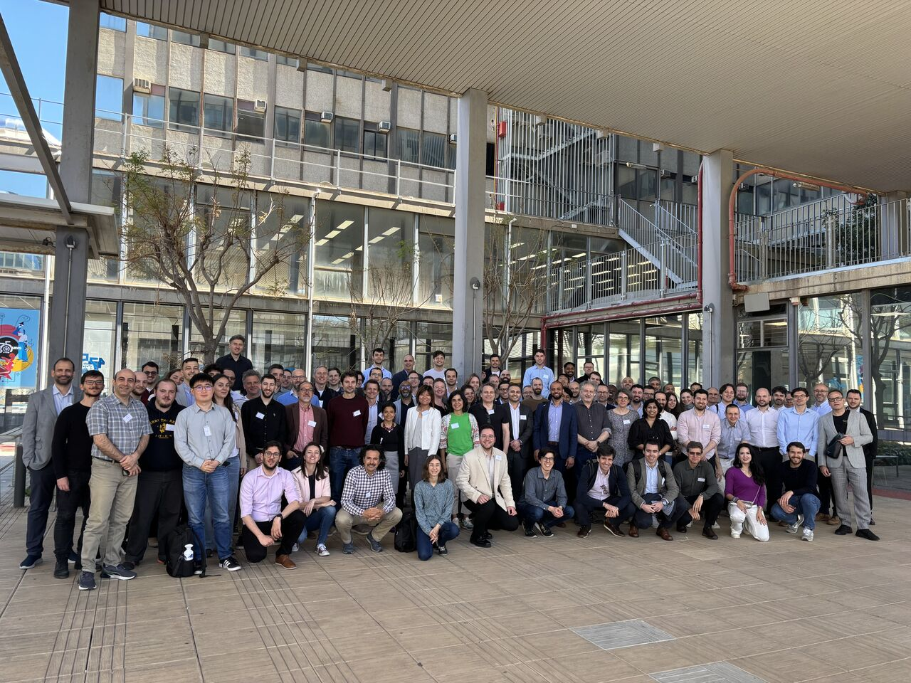
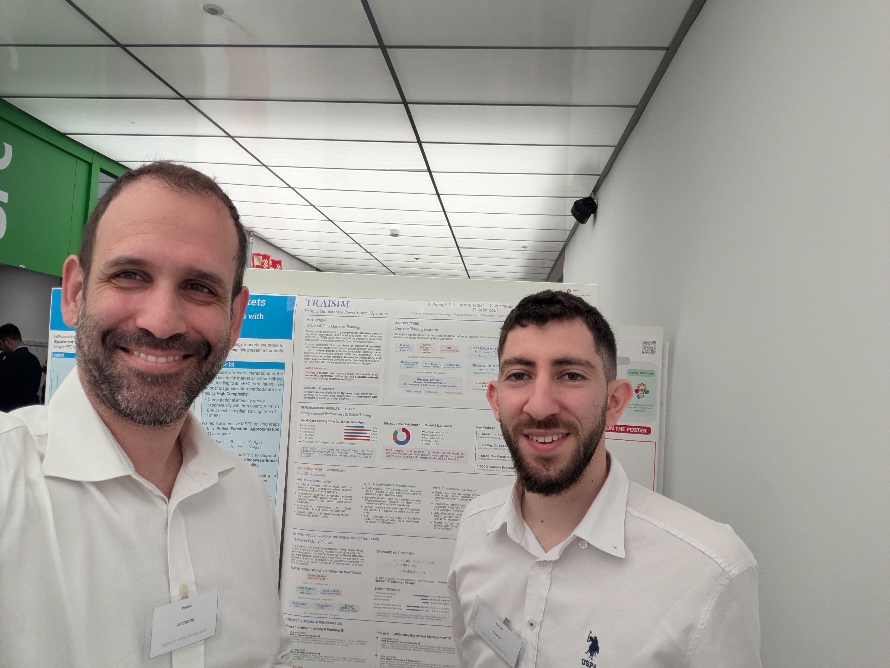

Our lab took part in **[CRESROADS 2026](https://www.linkedin.com/posts/cresroads2026-cresym-cresroads2026-share-7450829285717737472-vEqu)**, the annual gathering of the **[CRESYM](https://cresym.eu)** research community on open architectures and dynamic simulations for the future power system. The event brought together researchers, TSOs, and industry partners working on open-source modelling, simulation, and digital-twin tooling for transmission networks.

The SPS Lab was represented by {} and {}, who presented the **[TRAISIM](/project/traisim/)** project — our open-source real-time **Training Simulator for Power System Operators**, developed jointly with **Réseau de Transport d'Électricité (RTE)** and **CRESYM**.

The [poster](/publication/2026trpanagi/) summarises the Year-1 benchmarking effort on the RTE 6,000-bus French transmission network, identifies the KLU Analyze symbolic factorization as the dominant bottleneck under topology-changing events, and lays out the 2026 extension workplan: solver optimisation, an AI-driven Adaptive Model Selection (AMS) module based on a GATv2 graph-attention network, orchestrator co-design, and validation & dissemination.

The related PSCC 2026 paper — [*Towards an Open-Source Real-Time Operator-Training Platform: Analysis of Computational Efficiency*](/publication/2026cpanagi/) — will be presented in Limassol, June 8–12, 2026.
